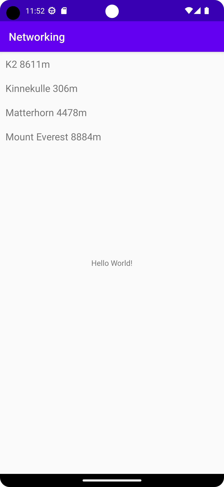

# Rapport

**Skriv din rapport här!**
Först skapade man en RecyclerView i layouten, därefter en Arraylist medlemsvariabel, en RecyclerViewAdapter
klass som man sedan använde sig utav för att ersätta objekten i recyclerview med mountains från 
FamousPeaksJSON URL (se Kodsegment 2) man använde Mountain-klassen för att göra om JSON-koden till
strängar (se Kodsegment 3 & bilaga 1).

```
public void onPostExecute(String json) {
        Gson gson = new Gson();
        Mountain[] mountains = gson.fromJson(json, Mountain[].class);

        ArrayList<RecyclerViewItem> items = new ArrayList<>();

        for (Mountain mountain : mountains) {
            items.add(new RecyclerViewItem(mountain.toString()));
        }

        RecyclerViewAdapter adapter = new RecyclerViewAdapter(this, items, item -> Toast.makeText(MainActivity.this, item.getTitle(), Toast.LENGTH_SHORT).show());

        RecyclerView view = findViewById(R.id.recycler_view);
        view.setLayoutManager(new LinearLayoutManager(this));
        view.setAdapter(adapter);

        adapter.notifyDataSetChanged();
    }
```
#Kodsegment 1

```
public class Mountain {
    @SerializedName("ID")
    private String id;
    private String name;
    private String type;
    //private String location;
    private String company;
    private String category;
    @SerializedName("size")
    private int meters;
    private int cost;
    private int height;

    // Default constructor

    public String getName() {
        return name;
    }

    @NonNull
    @Override
    public String toString() {
        return name + " " + meters+"m";
    }

}
```
#Kodsegment 2


#Bilaga 1